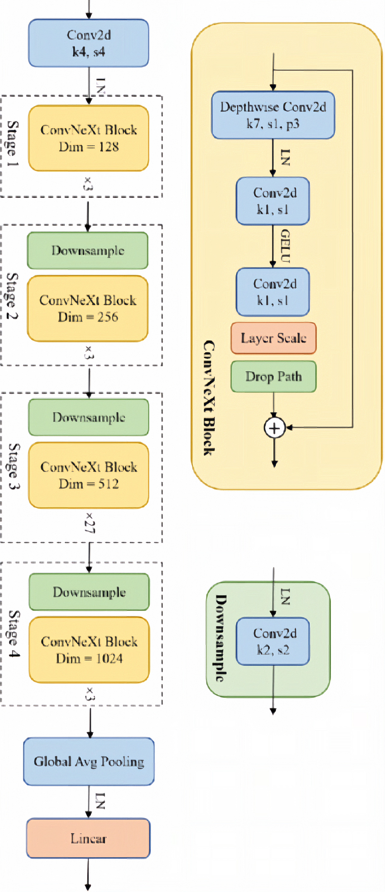
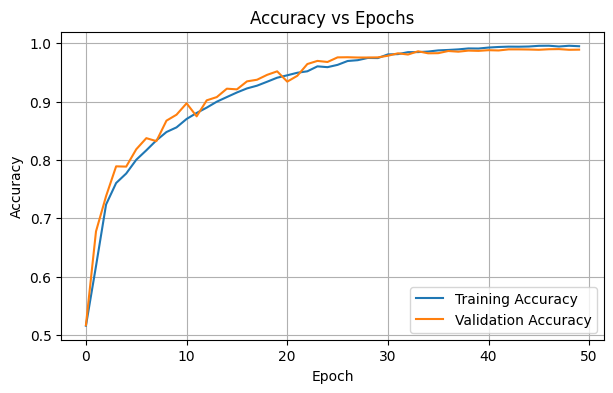
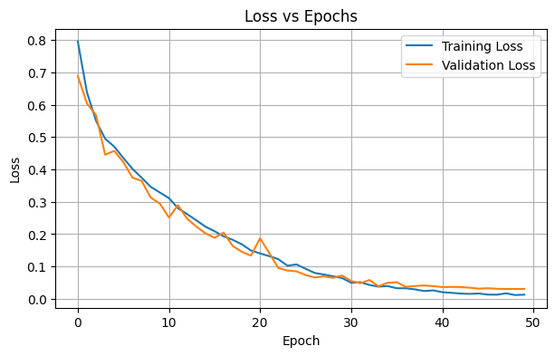

# Classifying Alzheimer's Disease using ConvNeXt

## Problem
Alzheimer's disease is a type of dementia that affects memory, thinking, and behaviour, and can eventually become severe enough to impact the ability to complete daily tasks. Early detection of this disease can help individuals better plan their medical care and live a better quality of life. This project applies ConvNeXt, a deep learning model, to classify MRI brain scans into Alzheimer’s Disease (AD) and Normal Control (NC) categories using the ADNI dataset.

ConvNeXt was chosen for this task because it combines the strengths of traditional convolutional networks with modern design improvements that make it more effective and efficient. MRI brain scans show very subtle structural differences between Alzheimer’s Disease and Normal Control subjects, so the model needs to recognise both fine details and overall patterns in the brain. ConvNeXt’s design allows it to do this effectively, making it well-suited for medical imaging tasks where accuracy and reliability are essential.

## Dataset
The Alzheimer’s Disease Neuroimaging Initiative (ADNI) dataset was used in this project. It contains MRI brain scans collected from individuals diagnosed with Alzheimer’s Disease (AD) and those classified as Normal Controls (NC). The dataset provides a reliable and well-balanced benchmark for evaluating deep learning models on medical image classification tasks. The dataset was provided on Rangpur, UQ’s HPC cluster, with the data already organised into separate training and testing sets. The training set contained 21,520 images, while the testing set contained 9,000 images.

## ConvNeXt Architecture


As illustrated in the diagram above, ConvNeXt processes MRI images through a hierarchical series of convolutional stages. The input image is first divided into non-overlapping patches using a convolutional stem, then passed through four stages of ConvNeXt blocks separated by downsampling layers. Each ConvNeXt block performs depthwise convolution for spatial feature extraction, Layer Normalisation, pointwise MLP transformation, and residual addition, enabling efficient feature reuse. The network progressively reduces spatial resolution while increasing channel depth, capturing both local and global structural information from the brain scans. Finally, global average pooling and a linear classifier output the probability of each class.

## Data Preprocessing

### Transformations
- **Resizing:**  
  Each MRI image was padded to 256×256 pixels to maintain aspect ratio and then resized to 224×224 pixels to match the ConvNeXt input size.
- **Augmentations:**  
  Random rotations, affine transformations, and slight colour jitter were applied to the training set to improve generalisation and reduce overfitting.  
  These augmentations help the model become more robust to small spatial variations and scanner differences across subjects.
- **Normalisation:**  
  Images were normalised to have a mean of 0.5 and a standard deviation of 0.5.  
  This ensures that pixel intensities are scaled to a consistent range, stabilising training and allowing the model to converge more efficiently.

### Train–Validation Split
20% of the training set was used for validation to monitor generalisation performance during training.  
The validation split was stratified to preserve the proportion of Alzheimer’s Disease (AD) and Normal Control (NC) samples, ensuring that class imbalance did not bias the validation results.

### Train–Test Split
The dataset provided on Rangpur, UQ’s HPC cluster, was already divided into separate training and testing sets.  
The training set contained 21,520 images, while the testing set contained 9,000 images.

## Training and Results
The model was trained for 50 epochs using mixed-precision training, a cosine learning rate schedule, and early stopping with a patience of 10 epochs. The plots below show the training and validation performance over time.





The model achieved a final test accuracy of 76.37%, demonstrating reasonable generalisation to unseen data.

Overall, the results indicate that ConvNeXt was able to effectively distinguish between Alzheimer’s Disease and Normal Control MRI scans. Minor fluctuations in validation accuracy suggest some overfitting, which could be mitigated in future work through additional regularisation, hyperparameter tuning, or data augmentation.

## Setup and Reproducibility

Key dependencies and versions used:
- `python` 3.12.12
- `torch` 2.8.0+cu126  
- `torchvision` 0.23.0+cu126  
- `numpy` 2.0.2  
- `scikit-learn` 1.6.1  
- `matplotlib` 3.10.0  
- `tqdm` 4.67.1  

All experiments were executed on an NVIDIA A100 GPU.  
To ensure reproducibility, a fixed random seed (`42`) was applied across NumPy, PyTorch, and Python’s `random` module.  
Deterministic operations were enabled where possible, and identical preprocessing and data splits were used for all runs.

To reproduce results:  
1. Clone the repository and ensure all dependencies are installed.  
2. Navigate to the `recognition` directory.  
3. 
    - To train the model, run:  
        ```
        python train.py
        ```
    - To perform inference on the test set, run:
        ```
        python predict.py
        ```
